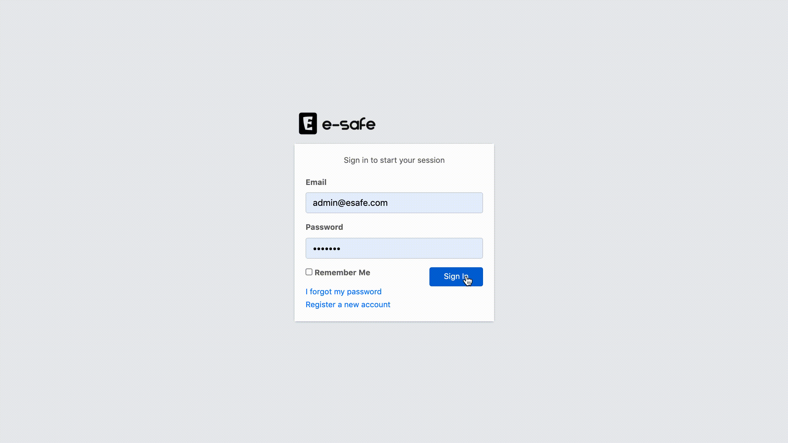
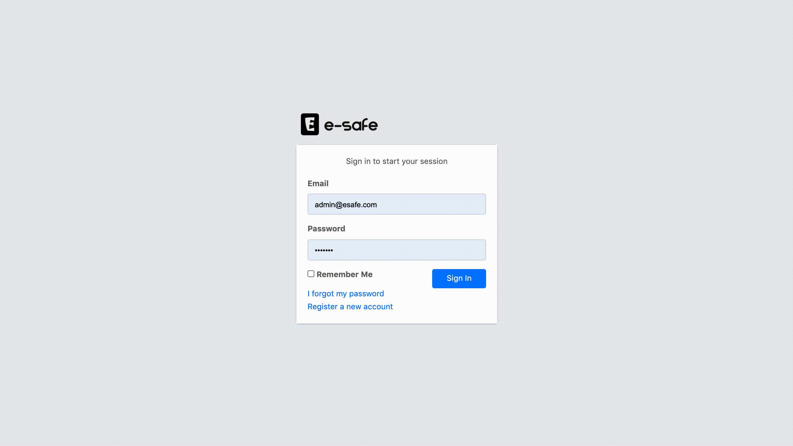
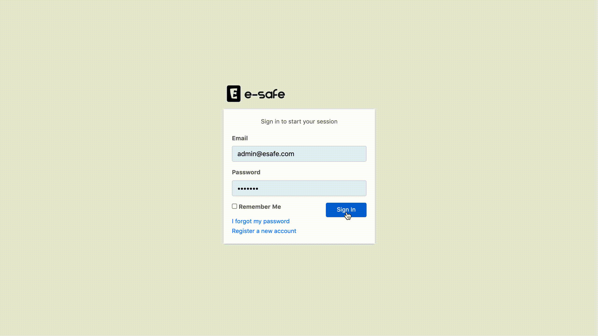
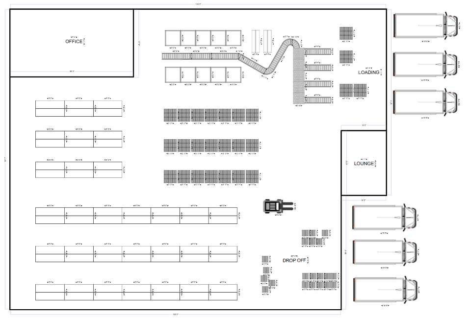
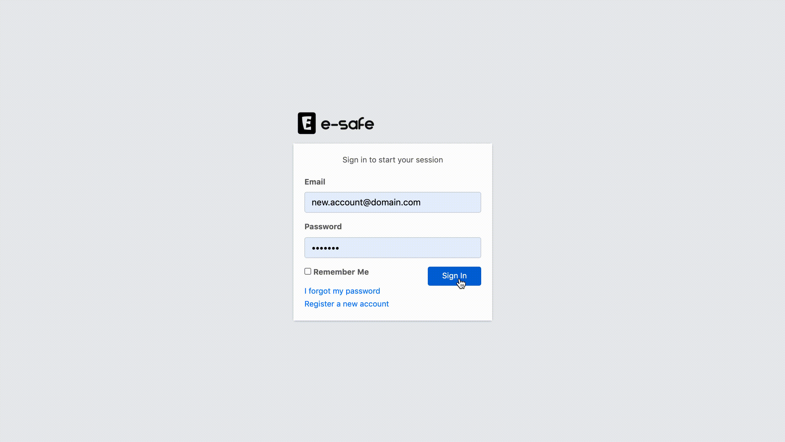
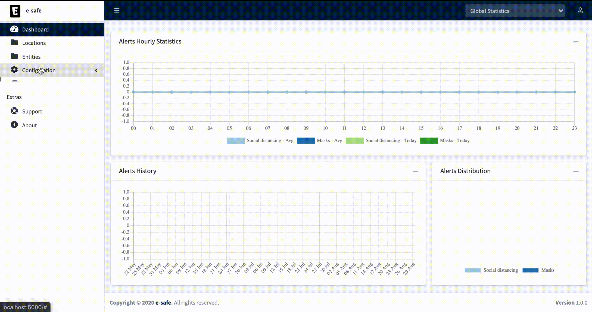

# e-safe for a safe work environment

<center>

</center>

A couple of months ago, me and a group of collegues data scientists competed in the [Together vs Virus Hackathon](https://togethervsvirus.devpost.com/) where we presented the [e-safe platform](https://devpost.com/software/social-distancing-in-factories) and ended up being shortlisted as one of the winning projects in that hackathon.

## Getting Started

The esafe platform is an all-in-one platform that allows in-depth monitoring of factories ensuring that workers keep a certain distance between each other while wearing covid-preventive gear (medical masks). The platform's capabilities can be extended to other types of alerts by integrating new models and devices.

An operator would be monitoring a dashboard receiving real time feed of information and alerts concerning different entities and plants (locations).

The following functionalities are currently implemented:
* Login system
* Registration system with activation email
* Password reset/change
* User Roles (Admin|Manager|Staff)
* Administration Panel with Flask-admin
* Camera calibartion pipeline
* Social distancing measurement in realtime camera streams.


<!--# How it works-->

# How to Setup

Two main strategies are on the table to run this application: Using Docker or Local a Flask Server.
The downsides of the later option is that you will have to install everything on your local system. Therefore we will opt for the docker option.


## Using Docker
### Prerequisite
- python 3.x: can be downloaded from [the official website](https://www.python.org/downloads/).
- docker: to install it, follow [this guide](https://docs.docker.com/get-docker/).
- docker-compose, can be installed following [this guide](https://docs.docker.com/compose/install/).
- Nvidia Drivers
- cuda>=10.1
- Nvidia Docker, follow [these instructions](https://github.com/NVIDIA/nvidia-docker#quickstart).
### Setting environment variables

Environment variables can be used within a docker-compose config file. When executing a docker-compose command, it checks for a file called `.env` in the same folder where the command is executed.

A template file for the required environment variables is already provided in the main folder of this repository. Execute the following command to create the `.env` file:
```
$ cp .env.copy .env
```

Open the `.env` file with any text editor and set the following variables:

- **POSTGRES_USER**: Used to create the specified user with superuser power.
- **POSTGRES_PASSWORD**: Sets the superuser password for PostgreSQL.
- **POSTGRES_DB**: Can be used to define a different name for the default database that is created when the PostgreSQL image is first started.
- **APP_ENV**: Defines on which mode to run the web application (development|production).
- **SECRET_KEY**: A secret key that will be used for securely signing the session cookie.
- **USE_GRPC**: Used to choose between REST and gRPC request to communicate with tensorflow serving service (true|false).
- **INFERENCER_LOGGING_LEVEL**: Sets the logging level for the inferencing service (debug|info|warning).
- **REQUIRE_EMAIL_CONFIRMATION**: Enable Email confirmation feature and requires users to verify their emails (true|false).

Another environment file called `mail.env` might be required if you set `REQUIRE_EMAIL_CONFIRMATION` to `true`:
```
$ cp mail.env-copy mail.env
```

### Building containers
Now, you are ready to build the images by executing the following commands:
```
$ docker-compose build
```

```
$ docker build -t ai404/tf-serving-esafe ./tf_serving
```
### Running the application
and finally to run the containers, use the following commands:
```
$ docker network create backend
```
```
$ docker-compose up [-d]
```
```
$ docker run [-d] --gpus all \
                  -p 8500:8500 -p 8501:8501 \
                  --network backend \
                  --name tf-serving-esafe ai404/tf-serving-esafe
```
If the `tf-serving-esafe` container is aleardy created use
```
$ docker start tf-serving-esafe
```
# Usage

Through these steps I will guide you to configure the app, and process some video feeds to monitor social distancing:

## 0. Setup mailing server
If `REQUIRE_EMAIL_CONFIRMATION` is set to `true`, an SMTP server is required for the app to function correctly. When on development environment you can use Google SMTP server (update the corresponding section in `mail.env` file). However you will have to setup your google account to [enable less secure apps](https://www.google.com/settings/security/lesssecureapps).

On the other hand production environment requires a mailgun account.

both can be setup on the `mail.env` file.

## 1. Create a Super Administrator
First step to use the app is to create a super administrator that has access to flask-admin panel required to assigne a scope to administrators and approve newly created accounts.

A script is already in place for this purpose.

On a terminal, execute the following command to create a super administrator:
```
$ docker exec -it webapp-esafe sh -c 'python web_app/scripts/create_su.py admin@esafe.com password'
```

## 2. Create an end user account
2.1. open [http://localhost/account/register](http://localhost/account/register) and fill in the registration form.\
2.2. If `REQUIRE_EMAIL_CONFIRMATION` is `true`, an email will be sent to your inbox for email confirmation.\
2.3. The account still needs to approved by a super administrator to be able to login.


## 3. Approve a New Registered Account
3.1. open [http://localhost/admin](http://localhost/admin) and login with your super administrator credentials.\
3.2. On the top navbar click on Company and create a new record.\
3.3. Go to the User navbar and assign the newly registered User to that company.\
3.4. Assign an Admin role on user's record.\
3.5. Check approved checkbox on user's record and save.


## 4. Create a Location and an Entity
4.1. Login with your end user account created in step 2.\
4.2. On the left sidebar select Locations and click on Add new Location.\
4.3. Fill in the form.\
4.4. For Location Image Plan use the one below and save.

<center>

</center>

4.5. On the left sidebar select Entities and click on Add new Entity.\
4.6. Fill in the form and save.


## 5. Create a Camera and assign it to an entity
Creating a camera requires setting up a configuration profile on the web application, and a live video feed.
### 5.1. Create a Camera Configuration
1. On the left sidebar select Configuration menu and click on Manage Cameras.
2. Select New from the listed buttons on the top-right side.
3. Fill in the form with the following and save:\
**Entity**: *Select the entity you created during step 4.*\
**Streaming URI**: *udp://0.0.0.0:2020?overrun_nonfatal=1&fifo_size=50000000*<br>(`overrun_nonfatal=1` prevents ffmpeg from exiting in case of UDP receiving circular buffer overrun and `fifo_size=50000000` is used to increase the udp input buffer to 50Mb)\
**Active**: *Checked*\
**Output Streaming**: *Checked*\
**Description**: *Camera One*

### 5.2. Simulate an IP Camera
As I didn't have access to an IP Camera that streams from open space with pedastrians walking in front of the camera, I had to simulate an IP Camera. So I found a recorded video of a street with people passing by and streamed a live feed of images with it using ffmpeg using the following command:
```
$ ffmpeg -i video.mp4 -b 50k -r 5 -s 1280x720 -f mpegts udp://0.0.0.0:2020
```

### 5.3. Camera Calibration
1. Go back to the created Camera profile and click on edit, you will see new fields added to the camera form.
2. Fill in the new fields as follows:\
**Horizontal Units**: 1\
**Vertical Units**: 1\
**Min Notification Units**: 1\
**Camera Localization**: Select where the camera is located\
**Camera Config**: Grab a frame with the ping button and draw a rectangle starting from the left-bottom point and ending with the right-upper point (forming an inverted Z). 

Camera calibration consists of grabing a frame from the camera stream and draw on it a rectangle as a reference with width and height defined as `Horizontal Units` and `Vertical Units`. With respect to these two dimensions we define `Min Notification Units` distance as a threshold to generate an alert when two people get close to each other.


## 6. Visualize Camera output with inference results
Once the Camera setting is done, you can now visualize the output from the camera.


<!--
# Used Technologies

* Python
* Flask
* Docker
* Docker compose
* Tensorflow
* Tensorflow Serving
* Protobuf
* Redis
* Socket.io
* Postgres
* Bootstrap 4
* JQuery
* nginx
* gunicorn
-->

# Additional Scripts
- Testing inference using REST:
```
$ docker exec -it inferencer-esafe sh -c 'python service/test_serving/test_serving_rest.py'
```
- Testing inference using gRPC:
```
$ docker exec -it inferencer-esafe sh -c 'python service/test_serving/test_serving_grpc.py'
```
- Generate dummy data for the super admin user
```
$ docker exec -it webapp-esafe sh -c 'python web_app/scripts/dummy_data.py'
```
# Credits

- [Landing AI problem formulation](https://landing.ai/landing-ai-creates-an-ai-tool-to-help-customers-monitor-social-distancing-in-the-workplace/)